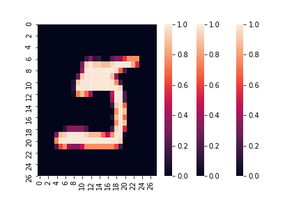

Neural networks are exploding through AI at the same pace as single-cell technology in genomics and GWAS consortia in genetics -- that is to say, very quickly. For one example, ImageNet error rates decreased tenfold from 2010 to 2017 ([source](http://image-net.org/challenges/talks_2017/imagenet_ilsvrc2017_v1.0.pdf)), but people are also now using neural networks to [play StarCraft at a superhuman level](https://deepmind.com/blog/alphastar-mastering-real-time-strategy-game-starcraft-ii/), [synthesize and manipulate photorealistic images of faces](https://www.youtube.com/watch?v=kSLJriaOumA), and yes, also to [analyze single-cell genomics data](https://www.ncbi.nlm.nih.gov/pmc/articles/PMC5737331/). This seems like a class of models I should consider learning to work with. 

Unfortunately, I tried to train a neural net on an image labeling task back in grad school and failed miserably. This left a bad taste in my mouth, and I'd like to start fresh. 

#### Getting started - theory

You don't need to know any theory at all to start fitting neural networks -- see next section. But on the surface of it, neural networks are not complicated compared to a lot of statistical & machine learning methods. A neural net is a just a flexible, tunable function with multiple inputs and (potentially) multiple outputs. It is composed of many sequential transformations:

$$NN(x) = f_n(g_n(f_{n-1}(g_{n-1}( ... f_1(g_1(x)) ... ))))$$.

The $g$'s are linear: for example, $g(x_1, x_2)$ might be $5x_1 + 2x_2 + 4$. The $f$'s are nonlinear: for example, $f(x_1, x_2)$ might be a sigmoid $\frac{1}{1+\exp -x}$. Training a neural network just means choosing different values of the parameters: $5x_1 + 2x_2 + 4$ versus $-x_1 + 2x_2 + 1$, for example. 

To do the training strategically rather than haphazardly, it helps to take the derivative of the neural net function. This is done using a terrifyingly named thing called "reverse mode automatic differentiation" (or autodiff), but autodiff is actually also simple. It's just a loop that repeatedly applies the chain rule from high school calculus: $\frac{dx}{dy} \frac{dy}{dz} = \frac{dx}{dz}$. The clever part is that it retains certain results as it goes, reusing them instead of starting from scratch at each layer; this speeds things up and saves electricity.

#### Getting started - software

I decided to get started using the [tensorflow MNIST tutorial](https://www.tensorflow.org/tutorials) for handwritten digit classification. The biggest hurdle was not running the model itself, which was actually a cinch; the problem was the setup. Tensorflow is a very fancy and powerful piece of software: autodiff is easier said than done, and tensorflow implements many additional features such as optimization algorithms and support for different types of hardware. So, it has certain [installation requirements](https://www.tensorflow.org/install). I had to update my operating system twice `>︹<`. After that, I had a bad time coaxing my notebook to [find the installation](https://anbasile.github.io/programming/2017/06/25/jupyter-venv/). (Technical aside: if you're sloppily following the linked instructions like I did, the trick is that it's not enough to have the `ipykernel` package installed globally. It has to be installed in the virtual environment that you are using. Virtual enviromnents contain isolated sets of packages for the Python programming language; here's [what](https://docs.python.org/3/library/venv.html) they are and [why](https://medium.com/knerd/best-practices-for-python-dependency-management-cc8d1913db82) I use them.)

Once I got that done, the Tensorflow example code ran like a charm.

    import tensorflow as tf 
    mnist = tf.keras.datasets.mnist
    (x_train, y_train),(x_test, y_test) = mnist.load_data()
    x_train, x_test = x_train / 255.0, x_test / 255.0
    model = tf.keras.models.Sequential([
        tf.keras.layers.Flatten(input_shape = (28, 28)),
        tf.keras.layers.Dense(512, activation = tf.nn.relu), 
        tf.keras.layers.Dropout(0.2),
        tf.keras.layers.Dense(10, activation = tf.nn.softmax)
    ])
    model.compile(optimizer = 'adam', 
                  loss = 'sparse_categorical_crossentropy', 
                  metrics = ['accuracy'])
    model.fit(x_train, y_train, epochs = 1)
    model.evaluate(x_test, y_test)
    
This code reports accuracy in the high nineties after training for a matter of seconds. Tensorflow is very impressive, and I might have had an easier time back in grad school if I had chosen to use it. (At the time, I was using [Theano](http://deeplearning.net/software/theano/), a similar tool.)
    
I did a little follow-up to explore the results. This code looks for the most confusing test example -- the one where the second best prediction is just about as good as the top prediction.

    import seaborn as sns
    import pandas as pd
    import numpy as np
    

    yhat = model.predict(x_test)
    X = pd.DataFrame(yhat)
    X['label'] = y_test
    X['index'] = X.index
    
    def get_confusion(x):
        y = x.copy()
        y.sort()
        return y[-2]
       
    X['confusion'] = np.apply_along_axis(get_confusion, 1, yhat.copy())
    
    sns.scatterplot(data = X, x = 'index', y = 'confusion', hue = 'label')
   
I added code to print the top five confusing digits so that I could pick my favorite.

    X = X.sort_values('confusion')
    for image in X.tail().index:
        confusing_digit = sns.heatmap( x_test[image] )
        confusing_digit.get_figure().savefig("confusing_digit" + str(image) + ".png")  
    
    
 

It's classified as a 5, and as a human, I agree with that, but it's also the worst 5 I have ever seen.

    
One hiccup happened when I went to write this up: I re-ran my code and got different images than before! Nondeterministic code makes for bad science, so I added the following four lines from [this tutorial](https://machinelearningmastery.com/reproducible-results-neural-networks-keras/) to make my output the same every time. (The bad 5 above is part of the final reproducible set.)
    
    from numpy.random import seed
    seed(0)
    from tensorflow import set_random_seed
    set_random_seed(0)

Fortunately, the model is giving very sensible results, even with confusing input, and I can move on to my next tutorial -- perhaps reproducing the [this paper](https://www.biorxiv.org/content/10.1101/262501v2.full) that analyzes epidermal stem cell development using neural networks. They also use Tensorflow, and they have a lovely [public code repository](https://github.com/luslab/scRNAseq-WGAN-GP).

