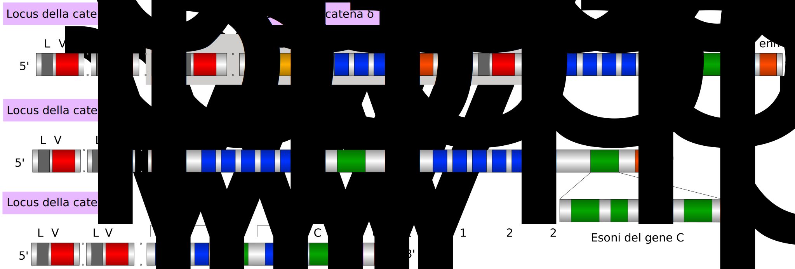
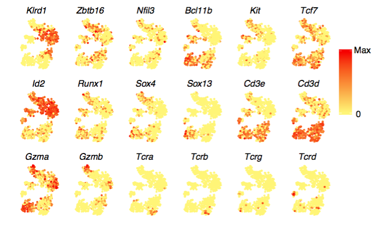

## The curious case of the missing T cell receptor transcripts: part 1

The [Maehr lab](http://maehrlab.net/) recently published a single-cell RNA atlas of thymus development ([paper](https://www.cell.com/immunity/abstract/S1074-7613(18)30184-5), [blogpost???](???)) in the mouse embryo. (Hooray!) 

Even though our lab is focused on the thymic epithelium, we also sequenced  T cells in this project. (The main function of the thymus is T cell selection, and when you dissociate a thymus into its component tissues, a large fraction is T cells.) But, when our collaborator David Fischer first looked into the T cells to begin studying their developmental dynamics ([preprint](https://www.biorxiv.org/content/early/2017/11/14/219188)), he didn't find a key hallmark: the T cell receptor itself! This post narrates how I chased them down. If you want to do something similar, there are step by step instructions at the end with example code. I'm not an expert in T cell receptor alignment, so if you are, I am very curious what you think of the details of this post.

##### Immunology background

This paragraph gives a smidge of immunology background; immunologists can skip it. The T cell receptor (and its evolutionary cousins the B-cell receptor and the antibody) are what allow the adaptive immune system to adapt. They are uniquely customizable: unlike typical genes, their DNA is stochastically rearranged during development, and this gives rise to many (about $10^{20}$) different T cell receptors. This flexibility allows for incredibly sensitive and specific detection of pathogens. 

There are four TCR genes: alpha, beta, gamma, and delta. Each one is laid out in segments. There are different types of segment -- the names don't matter a lot for the rest of the post, but you may hear people talk about variable (V), diversity (D), joining (J), and constant (C) regions. For each type, there may be several segments of that type. Each segment is a physical stretch of DNA that encodes a piece of the TCR. During the rearrangement process, only one segment of each type is chosen (except for D=diversity segments: zero to three D segments may be used). 

Below is a schematic of the T cell receptor genes. The detail is not essential to the post, so there's no need to study it deeply, but it's nice to have a visual aid. 

This TCR gene organization graphic is provided via Wikimedia Commons by Dan1gia2 under a Creative Commons Attribution-Share Alike 3.0 license. If you're reading it closely, you'll notice it's labeled in Italian. "Della catena alpha" means "of the alpha chain", i.e. TCRA. You may also notice that TCRD is inside TCRA. This is actually how it is in the genome; in fact, during TCRA rearrangement, TCRD may be entirely excised.

##### TCR alignment tools

David and I were dealing with an issue of messenger RNA quantification. The problem starts with tens of millions of short (50nt) reads from a sequencer. These are typically approached by first using alignment or pseudoalignment to figure out where on the genome each read originated, and then counting reads at each locus.

TCR transcripts cause problems for naive alignment procedures. Since the segments that make up a given TCR have been rearranged, they are contiguous in the mRNA, but not in the reference genome. Also, since different segments of the same type are very similar, it would be hard even to assign a read that falls entirely within one segment. As might be expected for a juicy analysis problem like this, 
[there is](https://www.ncbi.nlm.nih.gov/pmc/articles/PMC5073965/)
[a](https://www.ncbi.nlm.nih.gov/pubmed/26069265) 
[subfield](https://www.ncbi.nlm.nih.gov/pubmed/26963138)
[dedicated](https://www.ncbi.nlm.nih.gov/pmc/articles/PMC4654805/)
to T cell and B-cell receptor sequencing and analysis. David and I initially looked into TCR alignment using a couple of recent tools known as [TRACER](https://github.com/Teichlab/tracer#summarise-summary-and-clonotype-networks) and [TRAPeS](https://www.ncbi.nlm.nih.gov/pmc/articles/PMC5766189/). These tools are for single-cell sequencing data. They start with an assembly phase where they figure out how the rearrangement process has played out in each cell. TFor example, TRACER uses [Trinity](https://github.com/trinityrnaseq/trinityrnaseq/wiki/Genome-Guided-Trinity-Transcriptome-Assembly), which is a tool for de novo transcriptome assembly. After assembly, TRACER and TRAPeS quantify transcripts.

##### Our solution

Neither TRACER nor TRAPeS was built for Drop-seq data. TRACER wants full-length cDNAs whereas Drop-seq has only one read with transcript information. TRAPeS wants paired-end reads, whereas Drop-seq shows only 50 bases at the 3' end of the transcript. I was worried that the reconstruction stages of those pipelines were too ambitious given our sparse data, and since we're not doing what the TRACER and TRAPeS teams had in mind, I had no idea how the methods would behave. 

Fortunately, we didn't need to reconstruct the exact TCR rearrangement in each individual cell. We just wanted to know which cells expressed which TCR genes. After a bit of reading, I set out to build a simpler solution using some of the same raw ingredients used in TRACER and TRAPES.

Those raw ingredients are the actual sequences of the TCR gene segments. Since TCR genetics have been extensively studied in humans and mice, sequences for each segment are available online. My approach was to grab the individual sequences, put them all into a single "chromosome", and label the boundaries as splice junctions. Our usual single-cell RNA pipeline uses a spliced transcript aligner, which can skip between TCR segments as needed. (We use Drop-seq tools with the STAR aligner.) This is not an elegant solution, and I will discuss some potential improvements at the end of the post. But, it was easy and fast... and it totally worked! Below are a some tSNE plots from a supplemental figure panel in the thymus atlas paper. These contain only thymocytes, and they show cell-type-specific expression of TCR alpha and beta in the most mature thymocytes, which is what you would expect. 

Here's another panel, this time showing a mixture of thymocytes and innate lymphocytes. TCRs occur in the clusters that have high Cd3 expression; these are the T cells and the rest are innate lymphocytes. Within the T cells, TCRA and TCRB are coexpressed in the bottom right, while TCRG and TCRD are detected in every cluster except the bottom right.
 

##### Implementation details

If you'd like to see example code, implementation details, and links to reference data, check out [part 2](???).
