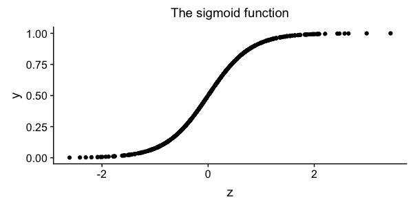

## Why logistic regression?

This miniseries is a multifaceted look at the derivations behind logistic regression. You're reading part 1, which gives notation and purpose. Here's [part 2???](???) and [part 3???](???).

--

Logistic regression is everywhere. Many people have explained the calculations in detail or given implementations, and I won't do that here. (For a bottom-up introduction, try [this post](http://adit.io/posts/2016-03-13-Logistic-Regression.html) or Christopher's Bishop's PRML section 4.3 ([link](https://www.amazon.es/Pattern-Recognition-Learning-Information-Statistics/dp/0387310738), [pdf](http://users.isr.ist.utl.pt/~wurmd/Livros/school/Bishop%20-%20Pattern%20Recognition%20And%20Machine%20Learning%20-%20Springer%20%202006.pdf)).) 

Instead, the following posts are about where logistic regression comes from. By understanding this, you can apply logistic regression more effectively.

- Part 2: Logistic regression works for *case-control studies*, which use a highly efficient biased sampling scheme common in epidemiology. 

- Part 3: Logistic regression is an exponential mixture model. Understanding this derivation -- or at least the punch line of it -- can help you decide when logistic regression is appropriate, and it can help you decide what features to use. 
 

### Notation

##### Prediction

Logistic regression is a classification method. Like other supervised machine learning methods, you train it on one set of data, and then you can apply it to another. To make a prediction with an already-trained  model, we start with vectors of features $x_n\in \mathbb{R}^D$ (for $n$ from $1$ to $N$), and we wish to predict binary labels $y_n \in \{0, 1\}$. The training has left us with a vector of coefficients $\beta \in \mathbb R^D$. In logistic regression, the prediction takes the form of a probability, $Pr(y_n=1)$. The exact procedure to compute it is: 

1. Compute the linear combination $z_n = \beta_0 + x_{n,1}\beta_1 + ... + \beta_D x_{n,D}$.
2. Squash the result using the sigmoid function $\frac{1}{1+\exp(-z_n)}$, depicted below. 

##### Training 

To train the model, you need to find a suitable value of $\beta$, which is typically done by maximizing the likelihood function. (That's equivalent to minimizing the cross-entropy loss function, if that's what you're familiar with.) If each observation is independent, then $$Pr(y_1, ... y_N | X, \beta) = Pr(y_1 | x_1, \beta) \cdot ... \cdot Pr(y_N | x_N, \beta)$$, and this product is called the likelihood. To maximize this, you could write the whole thing out, take a logarithm, take derivatives with respect to the $\beta$'s, and then use one of many out-of-the-box optimizers such as gradient descent or BFGS. For one example, my brother Paul Kernfeld [works this all out in Rust](https://paulkernfeld.com/2018/07/01/logistic-regression-in-rust.html). 
